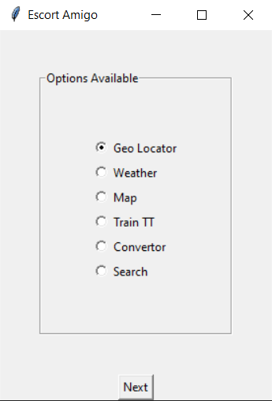
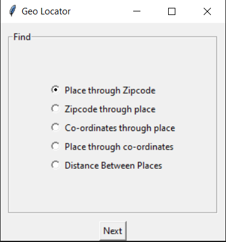
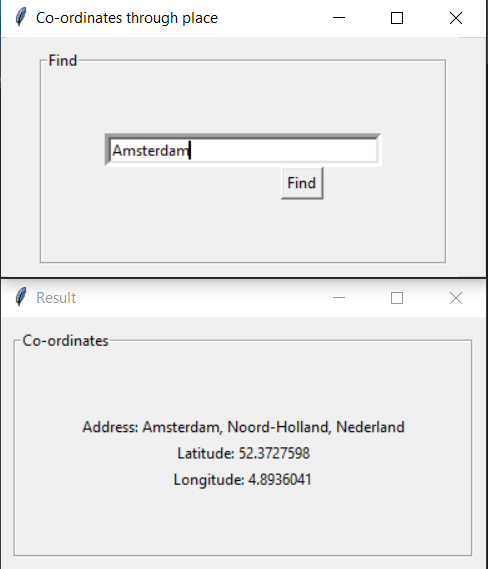

# EscortAmigo
# Escort Amigo

The objective of this project
is to develop a system that automates the
processes and activities of a travel guide
or agency by using Python modules and APIs.
Users can directly get the information they want by using this without being bothered of contacting a middleman. It compacts task of searching
tourist places, hotels, local best foods, train schedules, 
weather of that place, location, time zone, currency
and many more and makes them very easy to execute.


## Deployment

To deploy and run this project, your computer need to have latest version of python installed.


First, Install the library pyinstaller by opening commmand prompt and type:
```bash
  pip install pyinstaller
```

Now head to the directory where you have downloaded and stored the '.py' file.
Open 'PowerShell' in this directory.

Now type the following command in the powershell:
```bash
    pyinstaller --onefile -w EscortAmigo.py
```

If any error is encoutered then type:
```bash
    .\pyinstaller --onefile -w EscortAmigo.py
```

Now in the current directory there is a 'dist' folder which contains '.exe' file.
```bash
    Open and run 'EscortAmigo.exe'
```
## How to Use

It is pretty easy to use as everything is self-explainatory.
Just choose whatever you are looking for and fill the required fields then the desired output will be displayed in seconds.
 There is no complications of installing or referring API as it has already been taken care of in the code.
## Features

### All in one compact app
It is all purpose application as it provides user with various options to choose from which saves the time of searching for apps when in need for a specific need. 
### Cross platform
Users can run it on any platform (Linux, Mac OS, Windows etc.) as the only basic need for running this application is the user should have python installed in their system.
### Easy to understand UI
It has user friendly UI which makes it pretty easy use for everybody including people who are not very good with new technologies.






### Easily executable
It is pretty easy to execute as we have already seen above in 'Deployment' Section.


## License

This program is free software: you can redistribute it and/or modify it to make it better as in add more features and share. 

see, [MIT](https://choosealicense.com/licenses/mit/) for details
